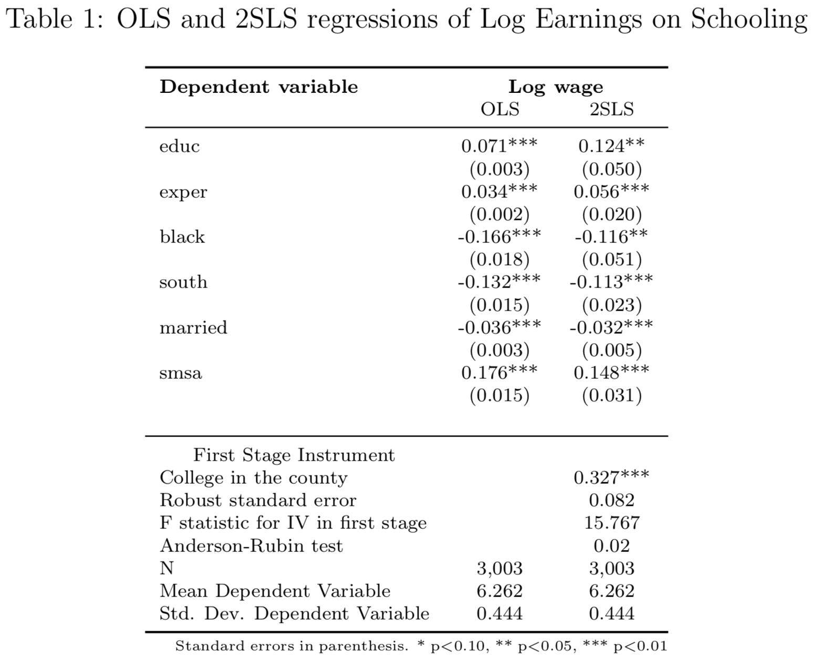
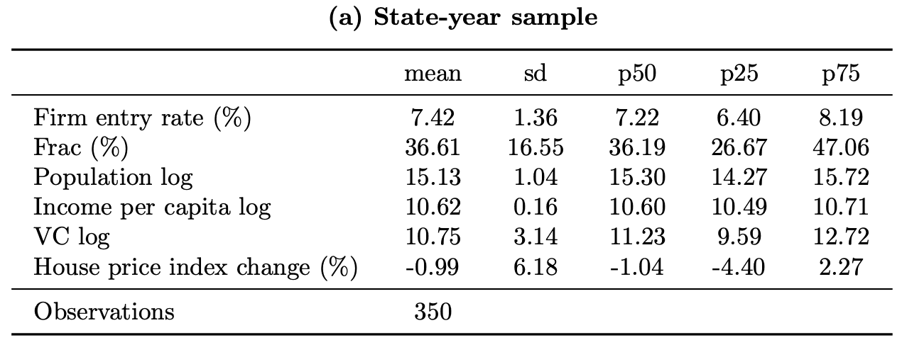
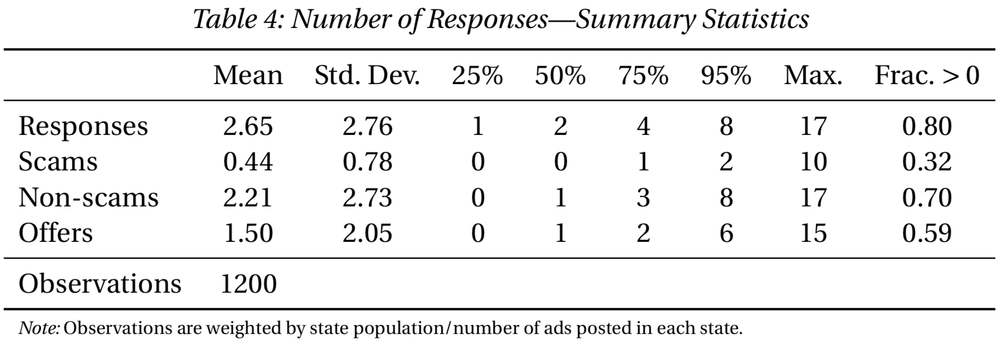
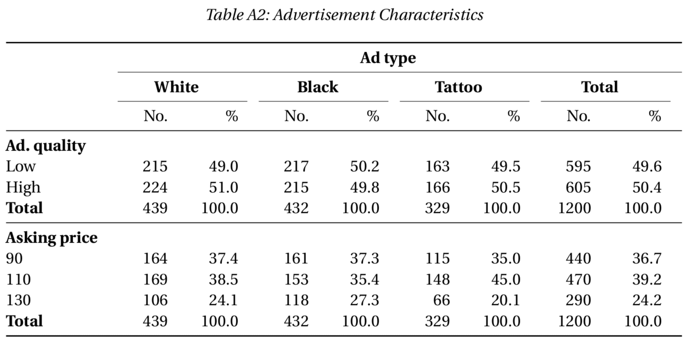

# Stata/LaTeX workflow gallery

[The main page on this site](../) describes variety of packages for programmatically generating LaTeX output using Stata. Examples are included in many packages' documentation; this page provides additional examples with code fragments.

> I [Luke] have seeded this gallery page with a few examples of my own tables, but
> have not sought out other contributions. Please feel free to send yours, or
> (even better) to let me know that you would like to take over compiling this
> gallery!

## `estout`/`esttab`

### Interactions, checkmarks, test statistics

Stata code

~~~
eststo  clear
eststo: areg empend_normsqi               after##c.frac lnpop lnpercap lnvc chHPI i.yq i.industry [weight=pa]  if ${SAMPLEIF} & age_buckets == 1, absorb(state) cluster(state)

eststo: areg empend_normsqi  lowsectorvc##after##c.frac lnpop lnpercap lnvc chHPI i.yq i.industry [weight=pa]  if ${SAMPLEIF} & age_buckets == 1, absorb(state) cluster(state)
test 1.after#c.frac + 1.lowsectorvc#1.after#c.frac = 0
estadd scalar sum_afterfrac_p = r(p)

eststo: areg empend_normsqi    empconc50##after##c.frac lnpop lnpercap lnvc chHPI i.yq i.industry [weight=pa]  if ${SAMPLEIF} & age_buckets == 1, absorb(state) cluster(state)
test 1.after#c.frac + 1.empconc50#1.after#c.frac = 0
estadd scalar sum_afterfrac_p = r(p)

eststo: areg empend_normsqi      highcap##after##c.frac lnpop lnpercap lnvc chHPI i.yq i.industry [weight=pa]  if ${SAMPLEIF} & age_buckets == 1, absorb(state) cluster(state)
test 1.after#c.frac + 1.highcap#1.after#c.frac = 0
estadd scalar sum_afterfrac_p = r(p)

esttab using "${OUTPATH}emp_entrants_industry", ///
nomtitles booktabs replace ///
order(1.after#c.frac ///
	1.lowsectorvc#1.after  1.lowsectorvc#c.frac 1.lowsectorvc#1.after#c.frac ///
	1.empconc50#1.after  1.empconc50#c.frac 1.empconc50#1.after#c.frac ///
	1.highcap#1.after  1.highcap#c.frac 1.highcap#1.after#c.frac ///
	lnpop lnpercap lnvc chHPI) ///
drop(frac 1.after  1.empconc50 1.lowsectorvc 1.highcap) ///
indicate("Annual state-level controls = lnpop lnpercap lnvc chHPI"   "State FE = _cons" "Quarterly FE = *.yq" "Industry FE = *.industry", labels("\checkmark" "")) ///
stats(N sum_afterfrac_p, labels("Observations" "\$p\$-val: \$\beta_{\text{Aft}\times\text{Frac}} + \beta_{\text{\ldots industry}\times\text{Aft}\times\text{Frac}} = 0 \$")) ///
label nobaselevels interaction("\$\times\$") substitute("=1" "") nonotes se star(* 0.10 ** 0.05 *** 0.01)
~~~

From [Lindsey and Stein (2019 WP)](https://papers.ssrn.com/sol3/papers.cfm?abstract_id=2939994)

### OLS and 2SLS with first stage and test statistics

Stata code

~~~
* This file will estimate the returns to college education using the "college in the county" instrumental variable
* which instruments for college attendance with whether there is a 2 or 4 year college near the respondent of the NLS.
* You will first need to install estout (ssc install estout), and you will need to pull the card data from my Mixtape
* in the cloud.  

use "https://storage.googleapis.com/causal-inference-mixtape.appspot.com/card", replace

cap n tempvar tempsample
cap n local specname=`specname'+1
reg  lwage  educ  exper black south married   smsa
cap n estadd ysumm
cap n estimates store ols_`specname'

cap n local specname=`specname'+1
reg educ nearc4 exper black south married   smsa
cap n local biv = _b[nearc4]
cap n local seiv = _se[nearc4]
cap n unab ivs: nearc4
cap n local xlist: colnames e(b)
cap n local ivs: list ivs & xlist
cap n test `ivs'
cap n local F_iv=r(F)
cap n local specname=`specname'+1

cap n ivregress 2sls lwage (educ=nearc4) exper black south married   smsa, first
cap n estadd ysumm
cap n estadd scalar biv  = `biv'
cap n estadd scalar seiv = `seiv'
cap n estadd scalar F_iv = `F_iv'
cap n rivtest
n return list
cap n local ar_chi2=r(ar_chi2)
cap n local ar_p=r(ar_p)
cap n estadd scalar ar_chi2 = `ar_chi2'
cap n estadd scalar ar_p = `ar_p'
cap n estimates store tsls_`specname'

#delimit ;
	cap n estout * using ./card.tex,
		style(tex) label notype
		cells((b(star fmt(%9.3f))) (se(fmt(%9.3f)par))) 		
		stats(biv seiv F_iv ar_p N ymean ysd, star(biv)
		labels("College in the county" "Robust standard error " "F statistic for IV in first stage" "Anderson-Rubin test" "N" "Mean Dependent Variable" "Std. Dev. Dependent Variable")
			fmt(3 3 3 2 %9.0fc 3 3))
		keep(educ exper black south married smsa) replace noabbrev starlevels(* 0.10 ** 0.05 *** 0.01)
		title(OLS and 2SLS regressions of Log Earnings on Schooling)   
		collabels(none) eqlabels(none) mlabels(none) mgroups(none)
		prehead("\begin{table}[htbp]\centering" "\scriptsize" "\caption{@title}" "\label{2sls_1}" "\begin{center}" "\begin{threeparttable}" "\begin{tabular}{l*{@E}{c}}"
"\toprule"
"\multicolumn{1}{l}{\textbf{Dependent variable}}&"
"\multicolumn{2}{c}{\textbf{Log wage}}\\"
"\multicolumn{1}{c}{}&"
"\multicolumn{1}{c}{OLS}&"
"\multicolumn{1}{c}{2SLS}\\")
		posthead("\midrule")
		prefoot("\\" "\midrule" "\multicolumn{1}{c}{First Stage Instrument}\\")  
		postfoot("\bottomrule" "\end{tabular}" "\begin{tablenotes}" "\tiny" "\item Standard errors in parenthesis. * p$<$0.10, ** p$<$0.05, *** p$<$0.01" "\end{tablenotes}" \end{threeparttable} \end{center} \end{table});
#delimit cr
~~~

From ["Causal Inference: The Mixtape" by Scott Cunningham](http://scunning.com/mixtape.html)

### Summary statistics

Stata code

~~~
gen t_entry_norm1 = entry_norm1 * 100
label var t_entry_norm1	"Firm entry rate (\%)"

gen t_frac = frac * 100
label var t_frac	"Frac (\%)"

gen t_chHPI = chHPI * 100
label var t_chHPI	"House price index change (\%)"

eststo clear
eststo: quietly estpost summarize	t_entry_norm1 ///
									t_frac lnpop lnpercap lnvc t_chHPI ///
								if ${SAMPLEIF} & (age_buckets == 1) & (pa > 0), detail

esttab using "${OUTPATH}summstat_bds_sy.tex", replace ///
	cells("mean(fmt(2)) sd(fmt(2)) p50(fmt(2)) p25(fmt(2)) p75(fmt(2))") label booktab nonumber nomtitles
eststo clear
~~~

From [Lindsey and Stein (2019 WP)](https://papers.ssrn.com/sol3/papers.cfm?abstract_id=2939994)

### Summary statistics with added column

Stata code

~~~
label var responses		"Responses"
label var scams			"Scams"
label var nonscams		"Non-scams"
label var offers		"Offers"

estpost tabstat anyresponse anyscam anynonscam anyoffer [aw = stateweight], statistics(mean) columns(statistics)
matrix anys = e(mean)
matrix colnames anys = responses scams nonscams offers	// Get column in same rows as responses scams nonscams offers
matrix rownames anys = anys

eststo clear
estpost tabstat responses scams nonscams offers [aw = stateweight], statistics(mean sd p25 p50 p75 p95 max count) columns(statistics)

estadd matrix anys

esttab using "${OUTPATH}numberresponsesw.tex", ///
	cells("mean(fmt(a2) label(Mean)) sd(fmt(a2) label(Std.\ Dev.)) p25(fmt(a2) label(25\%)) p50(fmt(a2) label(50\%)) p75(fmt(a2) label(75\%))  p95(fmt(a2) label(95\%)) max(fmt(a2) label(Max.)) anys(fmt(a2) label(Frac.\ $>0$))") ///
	nostar nonumbers nomtitle label booktabs width(38em) replace
~~~

From [Doleac and Stein (2013)](http://onlinelibrary.wiley.com/doi/10.1111/ecoj.12082/abstract)

## `tabout`

### Two-way crosstabulation with percentages

Stata code

~~~
global ADCHARS			"highquality price"
label var highquality "Ad.\ quality"

tabout ${ADCHARS} type using ${OUTPATH}adchars.tex, c(freq col) f(0 1) ///
	cl1(2-11) cl2(2-3 4-5 6-7 8-9 10-11) topstr(Advertisement Characteristics\label{tab:adchars}|\textwidth) ///
	replace style(tex) bt font(bold) topf(top.tex) botf(bot.tex)
~~~

From [Doleac and Stein (2013)](http://onlinelibrary.wiley.com/doi/10.1111/ecoj.12082/abstract)

## Note

I created this page in response to Twitter discussions suggesting there’s interest in learning more about the wide range of techniques researchers use to work with Stata and LaTeX. I also wanted to learn more about how to use github (where this page is hosted).

Please feel free to suggest additions, either by submitting pull requests to the github respository (if you know how to do so), or by [contacting me directly](http://lukestein.com/).
